# How This Works — Copilot Session Explorer

A complete technical guide for developers working on this project.  
Covers architecture, data flow, rendering pipeline, and every major subsystem.

---

## Table of Contents

- [1. Project Overview](#1-project-overview)
- [2. Architecture](#2-architecture)
- [3. JSONL Data Format](#3-jsonl-data-format)
- [4. Event Pipeline](#4-event-pipeline)
- [5. Rendering System](#5-rendering-system)
  - [5.1 ANSI Helpers](#51-ansi-helpers)
  - [5.2 STYLE_MAP — Per-Event Renderers](#52-style_map--per-event-renderers)
  - [5.3 Tool-Specific Renderers](#53-tool-specific-renderers)
  - [5.4 Markdown Table Formatter](#54-markdown-table-formatter)
- [6. PlaybackEngine](#6-playbackengine)
  - [6.1 Lifecycle](#61-lifecycle)
  - [6.2 Live Playback](#62-live-playback)
  - [6.3 Seeking & Replay](#63-seeking--replay)
  - [6.4 Snapshot Cache](#64-snapshot-cache)
  - [6.5 Render Cache](#65-render-cache)
  - [6.6 Speed & Batched Rendering](#66-speed--batched-rendering)
  - [6.7 Filters](#67-filters)
  - [6.8 Turn Navigation](#68-turn-navigation)
- [7. Sub-Agent Collapsing](#7-sub-agent-collapsing)
- [8. Search System](#8-search-system)
- [9. UI Layer](#9-ui-layer)
  - [9.1 Terminal Window Frame](#91-terminal-window-frame)
  - [9.2 Toolbar & Controls](#92-toolbar--controls)
  - [9.3 Timeline Scrubber](#93-timeline-scrubber)
  - [9.4 Welcome Screen](#94-welcome-screen)
  - [9.5 Keyboard Shortcuts](#95-keyboard-shortcuts)
  - [9.6 File Loading](#96-file-loading)
- [10. Theming](#10-theming)
- [11. Known Quirks & Workarounds](#11-known-quirks--workarounds)
- [12. File Map](#12-file-map)

---

## 1. Project Overview

Copilot Session Explorer is a **purely static web application** (no build step, no bundler, no
framework) that plays back `.jsonl` session files from GitHub Copilot CLI inside a terminal
emulator rendered by [xterm.js](https://xtermjs.org/).

The core idea: read a JSONL event stream, apply per-event-type ANSI styling, and write the
result into an xterm.js `Terminal` instance with VCR-like playback controls.

**Key constraints:**
- Zero dependencies to install — all libraries loaded from CDN
- Must work with any static HTTP server (`python -m http.server`, `npx serve`, etc.)
- The `events.jsonl` file is gitignored; users bring their own

---

## 2. Architecture

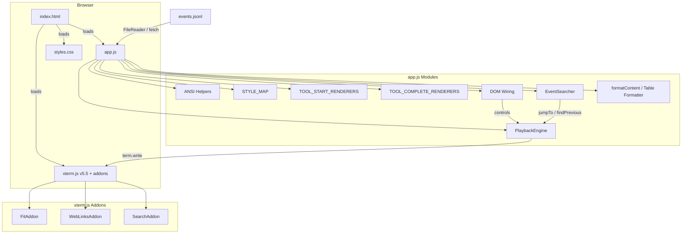

All code lives in a single `app.js` file (~1,900 lines), organized into clearly delimited
sections with comment banners. There is no module system — everything is in global scope or
within the `DOMContentLoaded` closure.

### Dependencies (loaded from CDN)

| Library | Version | Purpose |
|---------|---------|---------|
| `@xterm/xterm` | 5.5.0 | Terminal emulator core |
| `@xterm/addon-fit` | 0.10.0 | Auto-resize terminal to container |
| `@xterm/addon-web-links` | 0.11.0 | Clickable URLs in terminal output |
| `@xterm/addon-search` | 0.15.0 | Buffer text search + decorations |

---

## 3. JSONL Data Format

Each line in the `.jsonl` file is a self-contained JSON object:

```json
{
  "type": "assistant.message",
  "data": {
    "content": "Hello! I can help with that.",
    "reasoningText": "The user wants...",
    "toolRequests": [{ "name": "grep", "arguments": { "pattern": "TODO" } }]
  },
  "id": "evt_abc123",
  "timestamp": "2025-01-15T10:30:00Z",
  "parentId": null
}
```

### Event Types

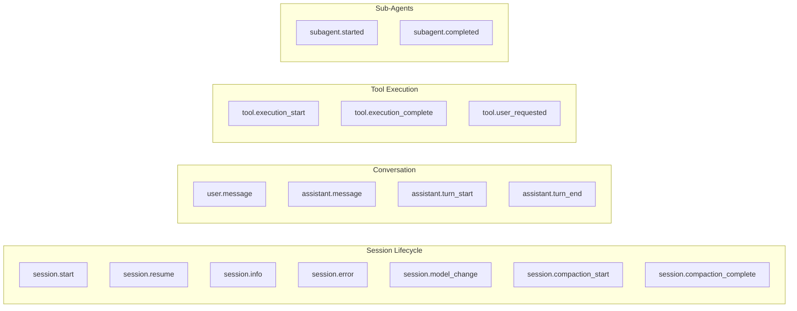

**Key data fields by event type:**

| Event Type | Notable `data` Fields |
|---|---|
| `session.start` | `sessionId`, `producer`, `copilotVersion`, `context.cwd`, `context.branch` |
| `user.message` | `content` |
| `assistant.message` | `content`, `reasoningText`, `toolRequests[]` |
| `tool.execution_start` | `toolCallId`, `toolName`, `arguments` |
| `tool.execution_complete` | `toolCallId`, `success`, `result.content` |
| `subagent.started` | `toolCallId`, `agentName`, `agentDisplayName`, `agentDescription` |
| Child events | `parentToolCallId` (links to parent agent's `toolCallId`) |

---

## 4. Event Pipeline

This is the journey of events from raw JSONL text to pixels on screen:

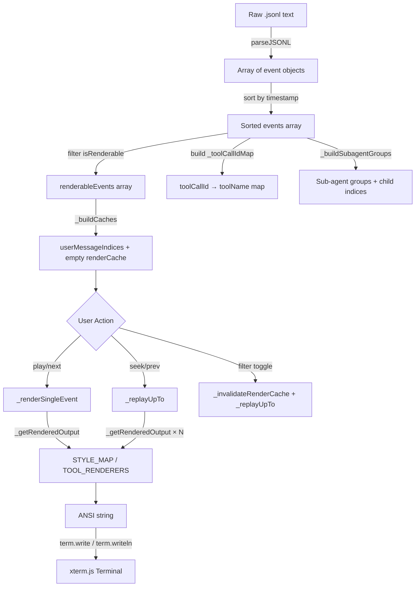

### `parseJSONL(text)`

Splits text by newlines, parses each line as JSON, sorts the resulting array by `timestamp`.
Invalid lines are silently skipped with a `console.warn`.

### `isRenderable(ev)`

A whitelist check against `RENDERABLE_TYPES` — a Set of 14 event types that produce visual
output. Events like `assistant.thought` or internal system events are excluded.

### `_toolCallIdMap`

A global `Object` mapping `toolCallId → toolName`, populated during `load()` by scanning all
`tool.execution_start` events. This lets `tool.execution_complete` events (which only carry
`toolCallId`, not `toolName`) look up which tool they belong to and use the correct completion
renderer.

---

## 5. Rendering System

### 5.1 ANSI Helpers

The `ansi` object wraps text in ANSI escape sequences that xterm.js interprets for styling:

```js
const ESC = '\x1b[';
const RESET = `${ESC}0m`;

ansi.bold(text)           // \x1b[1m ... \x1b[0m
ansi.dim(text)            // \x1b[2m
ansi.italic(text)         // \x1b[3m
ansi.underline(text)      // \x1b[4m
ansi.fg.cyan(text)        // \x1b[36m  (16 foreground colours)
ansi.fg.brightCyan(text)  // \x1b[96m  (bright variants)
ansi.fg.gray(text)        // \x1b[90m  (bright black = gray)
ansi.bg.blue(text)        // \x1b[44m  (6 background colours)
```

These compose: `ansi.bold(ansi.fg.cyan('hello'))` nests the escape codes.

### 5.2 STYLE_MAP — Per-Event Renderers

The `STYLE_MAP` object is the core styling configuration. Each key is an event type string, and
each value is a function:

```
(event: Object, filters: {tools, reasoning, system}) → string | null
```

Returning `null` suppresses the event entirely. The string is ANSI-styled terminal output with
`\r\n` for line breaks (xterm.js uses `\r\n`, not `\n`).

**Key renderers:**

| Event | Rendering Strategy |
|-------|-------------------|
| `session.start` | Double-line box border (`╔══╗`) with session metadata |
| `user.message` | Cyan `❯ USER` header + word-wrapped content |
| `assistant.message` | Compound: reasoning (italic blue) + content (white) + tool request summary (yellow) |
| `tool.execution_start` | Delegates to `TOOL_START_RENDERERS[toolName]` |
| `tool.execution_complete` | Delegates to `TOOL_COMPLETE_RENDERERS[toolName]` via `_toolCallIdMap` lookup |
| `session.error` | Bright red with `✖ ERROR` prefix |

The `assistant.message` renderer is the most complex — it conditionally renders three sections
(reasoning, content, tool requests) and uses `formatContent()` for markdown table detection.

### 5.3 Tool-Specific Renderers

Two separate renderer maps handle tool calls:

**`TOOL_START_RENDERERS`** — 15 entries for tool invocation display:

| Category | Tools | Visual Pattern |
|----------|-------|---------------|
| Shell | `powershell`, `read_powershell`, `write_powershell`, `stop_powershell`, `list_powershell` | Yellow `$` prefix, dim description comments |
| Files | `view`, `edit`, `create` | Cyan eye / green pencil + shortened path |
| Search | `grep`, `rg`, `glob` | Yellow magnifying glass + pattern + path |
| Agents | `task`, `read_agent` | Bold magenta robot emoji + agent type + model |
| Web | `web_fetch`, `web_search` | Blue globe + URL or search query |
| Data | `sql` | Cyan database icon + query preview |
| UX | `ask_user`, `task_complete`, `report_intent`, `update_todo` | Various icons and colours |

**`TOOL_COMPLETE_RENDERERS`** — 15 entries for tool result display.  
Completions correlate back to their start event via `_toolCallIdMap[toolCallId]`.

- ✔ green for success, ✖ red for failure
- Some completions are suppressed (e.g., `view` → `null`, `report_intent` → `null`)
- Agent results (`task`, `read_agent`) show truncated previews

**Helper functions:**
- `shortenPath(p)` — shows last 3 path segments: `D:\a\b\c\d\e.ts` → `…\c\d\e.ts`
- `truncate(s, max)` — single-line truncation with `…` suffix
- `summariseArgs(args)` — extracts first meaningful arg (`path`, `command`, `pattern`, etc.)

### 5.4 Markdown Table Formatter

The `formatContent(text, maxWidth)` function replaces raw `wordWrap()` for assistant message
content. It detects markdown table blocks and renders them as Unicode box-drawing tables.

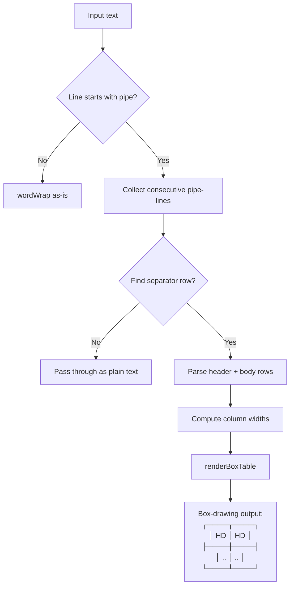

**Detection criteria:**
1. Consecutive lines starting with `|`
2. Contains a separator row matching `/^\|[\s:]*-+[\s:]*(\|[\s:]*-+[\s:]*)*\|?\s*$/`
3. At least: 1 header row + 1 separator + 1 body row

**Styling:** Borders use `ansi.dim()`, headers use `ansi.bold(ansi.fg.brightCyan())`, body cells
use `ansi.fg.white()`.

Non-table text passes through `wordWrap()` identically, ensuring zero regression for regular
content.

---

## 6. PlaybackEngine

The `PlaybackEngine` class is the heart of the application. It manages the event list, playback
state, caching, filtering, and all terminal output.

### 6.1 Lifecycle

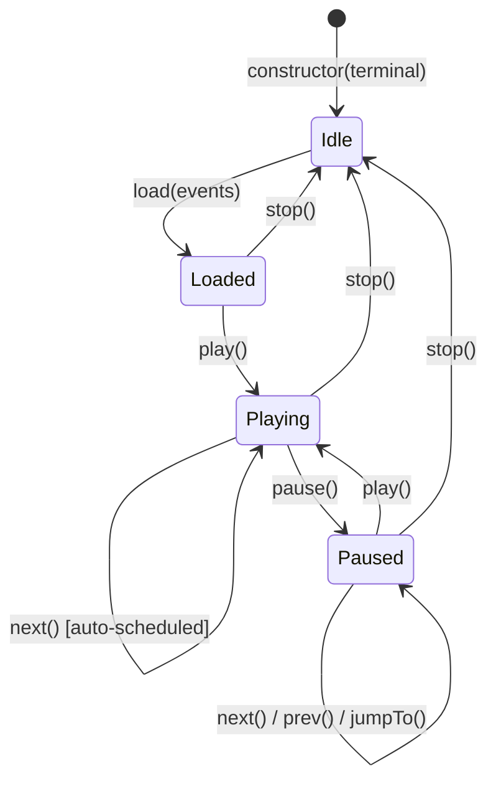

**Constructor state:**

| Property | Type | Purpose |
|----------|------|---------|
| `events` | `Array` | All parsed events (unfiltered) |
| `renderableEvents` | `Array` | Events passing `isRenderable()` |
| `currentIndex` | `number` | Position in `renderableEvents` (-1 = not started) |
| `playing` | `boolean` | Whether auto-advance timer is running |
| `speed` | `number` | Playback multiplier (1–50) |
| `timer` | `number\|null` | `setTimeout` handle for next event |
| `filters` | `Object` | `{ tools, reasoning, system }` booleans |
| `_snapshots` | `Map` | Index → cumulative ANSI buffer |
| `_renderCache` | `Array` | Per-event rendered output cache |
| `_userMessageIndices` | `Array` | Indices of `user.message` events |
| `_subagentGroups` | `Object` | `parentToolCallId → { agentName, indices[] }` |
| `_subagentChildIndices` | `Set` | Fast child-event lookup |
| `onUpdate` | `Function\|null` | UI sync callback |

### 6.2 Live Playback

When playing, each event is rendered individually via `_renderSingleEvent(index)`:

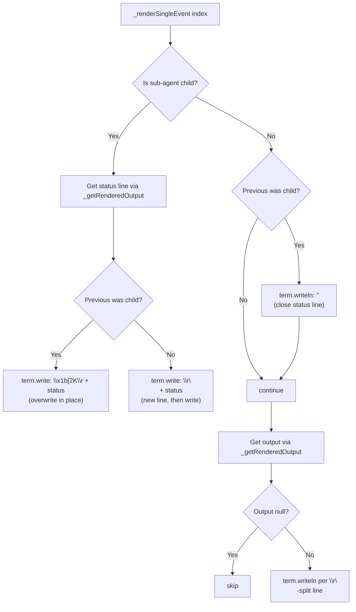

The `_lastWasSubagentChild` flag ensures proper newline management when transitioning between
normal events and sub-agent status lines.

### 6.3 Seeking & Replay

When seeking backward or jumping to an arbitrary position, the terminal must be rebuilt from
scratch (or from the nearest snapshot). `_replayUpTo(index)` handles this:

1. **Find nearest snapshot** — iterate `_snapshots` Map for largest key ≤ target
2. **Clear terminal** — `terminal.clear()` + `terminal.reset()`
3. **Pre-compute sub-agent collapse** — for each agent group, find the last child with a non-null
   status line before the target index
4. **Build output buffer** — loop from `startFrom` to `index`:
   - Sub-agent children: only render the "last child" per group
   - Normal events: call `_getRenderedOutput(i)` and append with `\r\n`
   - Save snapshots at interval boundaries
5. **Write once** — `terminal.write(fullBuffer, callback)` for performance
6. **Scroll** — `setTimeout(() => terminal.scrollToBottom(), 50)` in the write callback

### 6.4 Snapshot Cache

Snapshots are cumulative ANSI buffers captured every `SNAPSHOT_INTERVAL` (200) events. They
allow seeking to, say, event 5,000 by replaying only from event 4,800 (nearest snapshot at 4,800)
instead of from event 0.

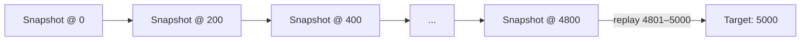

**FIFO eviction:** Max 50 snapshots. When full, the oldest snapshot is deleted.  
**Invalidation:** Clearing all snapshots happens when filters change (`_invalidateRenderCache`).

### 6.5 Render Cache

`_renderCache` is a simple array (same length as `renderableEvents`) that memoizes the output of
`_getRenderedOutput(index)`. Each slot is either:
- `undefined` — not yet computed
- `null` — computed but suppressed (filtered out or empty)
- `string` — the ANSI-styled output

Invalidated on filter change. Not invalidated on seek (cached values remain valid).

### 6.6 Speed & Batched Rendering

The speed slider (1×–50×) divides `BASE_DELAYS` by the speed factor.

At speeds ≥10×, events are rendered in batches per animation tick:
- Batch size = `min(floor(speed / 5), 20)`
- At 50× speed: batch size = 10 events per tick, 16ms minimum delay

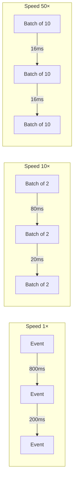

### 6.7 Filters

Three filter categories toggle visibility of event groups:

| Filter | Controls | Keyboard |
|--------|----------|----------|
| `tools` | `tool.execution_start`, `tool.execution_complete`, `tool.user_requested` | `T` |
| `reasoning` | The reasoning/thinking portion of `assistant.message` | `Y` |
| `system` | `session.info`, `session.compaction_*`, `session.model_change`, `session.resume` | `I` |

**Filter exemption:** Agent-related tool calls (`task`, `read_agent`) always render even when the
tools filter is off, because they represent significant session structure.

When a filter changes:
1. Render cache is invalidated
2. Terminal is replayed up to current position with new filter state

### 6.8 Turn Navigation

`_userMessageIndices` is an array of indices in `renderableEvents` where `type === 'user.message'`.
`nextUserMessage()` / `prevUserMessage()` find the nearest index and call `jumpTo()`.

---

## 7. Sub-Agent Collapsing

Background agents (launched via the `task` tool) generate large volumes of child events that
would overwhelm the view. The collapsing system condenses each agent's activity into a single
overwriting status line.

For full details, see [subagent-collapsing.md](./subagent-collapsing.md).

**Summary:**

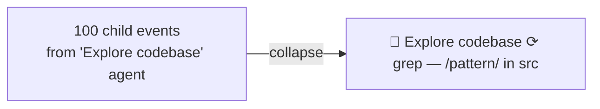

- Child events identified by `data.parentToolCallId`
- Groups built during `load()` from `subagent.started` and `task` tool calls
- Live playback: `\x1b[2K\r` ANSI overwrite for in-place updates
- Seek/replay: only the last status line per group is rendered
- Search: child events excluded from results

---

## 8. Search System

Search operates on two layers:

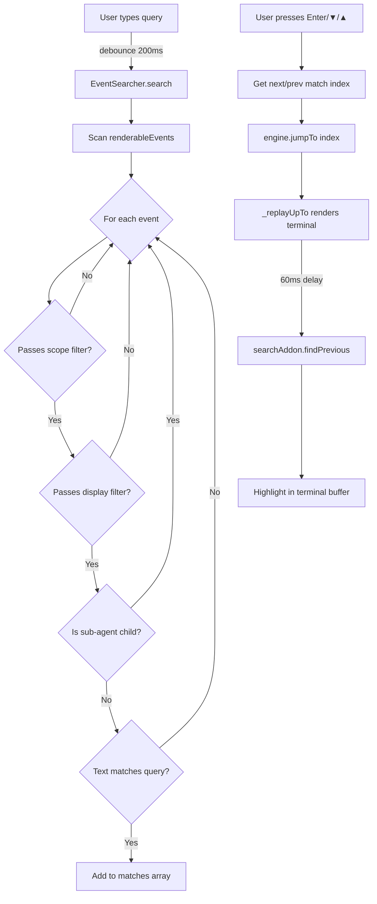

### EventSearcher

Custom search engine that understands event structure:
- Extracts searchable text from `content`, `reasoningText`, `toolName`, `arguments`, `result.content`, `agentName`
- Respects **scope filters** (User / Assistant / Tools checkboxes)
- Respects **display filters** (tools/reasoning/system toggles)
- Skips collapsed sub-agent children

### Search Scopes

The `SEARCH_SCOPES` map categorises event types into three searchable scopes:

| Scope | Event Types |
|-------|------------|
| `user` | `user.message` |
| `assistant` | `assistant.message`, `session.*` |
| `tools` | `tool.*`, `subagent.*` |

### Terminal Highlighting

After `jumpTo()` replays the terminal, `highlightSearchInTerminal()` calls
`searchAddon.findPrevious()` with a 60ms delay (to allow xterm's async write to flush). This
highlights the matched text in the terminal buffer using xterm's built-in search decoration.

---

## 9. UI Layer

### 9.1 Terminal Window Frame

The terminal is wrapped in a macOS-style window frame:

```
┌──────────────────────────────────────────┐
│ 🔴 🟡 🟢    copilot-agent — events.jsonl │  ← .terminal-titlebar
├──────────────────────────────────────────┤
│                                          │
│  xterm.js terminal                       │  ← #terminal-container
│                                          │
└──────────────────────────────────────────┘
```

- **Traffic light dots** — decorative (red/yellow/green circles)
- **Title** — dynamically set to `{producer} — {filename}` on file load
- **Container** — `flex: 1` fills remaining height; `FitAddon` auto-sizes the terminal

### 9.2 Toolbar & Controls

```
┌─────────────────────────────────────────────────────────────────┐
│ 📂 Load │ badge │  ⏮ ◀ ▶ ▶ ⏭ ⏹  │  ⚙ 💭 ℹ │ 🏎️ 1x │ 0/0 │ ? │ 🐙 │
│  LEFT   │       │     CENTER       │       RIGHT                │
└─────────────────────────────────────────────────────────────────┘
```

| Control | Action | Key |
|---------|--------|-----|
| ⏮ | Previous user message | Shift+← |
| ◀ | Previous event | ← |
| ▶ (play) | Play / Pause | Space |
| ▶ (next) | Next event | → |
| ⏭ | Next user message | Shift+→ |
| ⏹ | Restart (stop + reset) | R |
| ⚙ Tools | Toggle tool events | T |
| 💭 Think | Toggle reasoning | Y |
| ℹ Sys | Toggle system events | I |
| ? | Keyboard shortcuts overlay | ? |
| 🐙 | Link to GitHub repository | — |

### 9.3 Timeline Scrubber

An `<input type="range">` spanning the full width. Interactive markers are placed at the positions
of user messages (cyan) and errors (red):

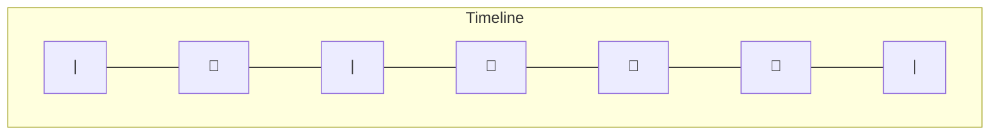

Markers are `<div>` elements positioned via `left: (index / total) * 100%`.

**Debounced seeking:** The `input` event on the scrubber triggers a 50ms debounced `jumpTo()`.
A `scrubberUpdating` flag prevents the engine's `onUpdate` callback from fighting with user dragging.

### 9.4 Welcome Screen

On first load (before a file is loaded), the terminal displays a centered ASCII art logo:

```
     ██████╗  ██████╗ ██████╗ ██╗██╗      ██████╗ ████████╗
     ██╔════╝ ██╔═══██╗██╔══██╗██║██║     ██╔═══██╗╚══██╔══╝
     ██║      ██║   ██║██████╔╝██║██║     ██║   ██║   ██║
     ...
              S E S S I O N    E X P L O R E R
```

Centered both vertically (using `term.rows`) and horizontally (using `term.cols`). Includes
step-by-step instructions for getting a session file via the `/session` CLI command.

### 9.5 Keyboard Shortcuts

All shortcuts are wired in a single `keydown` listener on `document`. The listener:
1. Skips when focus is in the search input (`e.target === searchInput`)
2. Handles Escape for overlay/search dismissal first
3. Dispatches via `switch (e.code)` for all other keys
4. Calls `e.preventDefault()` to avoid browser defaults (e.g., Space scrolling the page)

### 9.6 File Loading

Two paths to load a file:

1. **File picker** — `<input type="file" accept=".jsonl">` hidden behind a styled label
2. **Drag & drop** — `dragenter/dragleave/dragover/drop` on `document`, with a visual overlay

Both call `loadFile(file)` which uses `FileReader.readAsText()` → `parseJSONL()` → `engine.load()`.

**Auto-load:** On page load, the app attempts to `fetch('events.jsonl')`. If the file exists
alongside `index.html`, it loads automatically without user interaction.

---

## 10. Theming

The visual theme is **Tokyo Night** inspired, defined in two places:

### xterm.js Terminal Theme (app.js)

The `Terminal` constructor receives a `theme` object mapping semantic colour names to hex values:

| Semantic | Hex | Usage |
|----------|-----|-------|
| `background` | `#1a1b26` | Terminal background |
| `foreground` | `#c0caf5` | Default text |
| `cyan` | `#7dcfff` | User messages |
| `magenta` | `#bb9af7` | Agent/sub-agent events |
| `red` | `#f7768e` | Errors |
| `green` | `#9ece6a` | Success indicators |
| `yellow` | `#e0af68` | Tool calls, warnings |
| `blue` | `#7aa2f7` | Session info, reasoning |

### CSS Theme (styles.css)

The page chrome uses matching colours:
- Background: radial gradient from `#1f2335` to `#16161e`
- Toolbar/scrubber: `rgba(22, 22, 30, 0.85)` with `backdrop-filter: blur(10px)`
- Buttons: `#292e42` background, `#3b4261` borders, `#7aa2f7` accent
- Font: Cascadia Code → Fira Code → JetBrains Mono → Consolas fallback chain

---

## 11. Known Quirks & Workarounds

### Emoji Double-Width

Terminal emulators render emojis as double-width characters. When placing text after an emoji,
an extra space is needed to avoid overlap:

```js
// ✅ Correct — double space after emoji
`  🔍  grep /pattern/`

// ❌ Wrong — text overlaps emoji
`  🔍 grep /pattern/`
```

All renderers follow this convention.

### Scrollbar Click Interception

xterm.js places `.xterm-screen` after `.xterm-viewport` in the DOM. Since `.xterm-screen` has
`position: relative`, it paints on top of the viewport and intercepts scrollbar clicks.

**Fix in styles.css:**
```css
.xterm .xterm-viewport {
  left: auto !important;
  width: 14px !important;
  z-index: 5;
}
```

This narrows the viewport to just the scrollbar column and raises it above the screen layer.

### Scroll After Large Buffer Write

After `_replayUpTo()` writes a large buffer, xterm.js may not have finished layout by the time
`scrollToBottom()` runs. A 50ms `setTimeout` in the write callback ensures the scroll happens
after rendering completes.

### Filter Exemption for Agent Calls

When the "Tools" filter is off, agent-launching tool calls (`task`, `read_agent`) remain visible
because hiding them would obscure important session structure. This is enforced in
`_getRenderedOutput()` with explicit `toolName` checks.

---

## 12. File Map

```
copilot-session-explorer/
├── index.html                      # Page structure, toolbar, overlays
│                                   # Loads xterm.js + addons from CDN
│
├── app.js                          # All application logic (~1,900 lines)
│   ├── Lines 1–45                  # ANSI escape code helpers
│   ├── Lines 47–59                 # EVENT_CATEGORIES (filter mapping)
│   ├── Lines 61–81                 # BASE_DELAYS (playback timing)
│   ├── Lines 83–225                # TOOL_START_RENDERERS (15 tools)
│   ├── Lines 227–365               # TOOL_COMPLETE_RENDERERS (15 tools)
│   ├── Lines 367–609               # Utility helpers (shortenPath, truncate, wordWrap, etc.)
│   ├── Lines 631–762               # Markdown table formatter
│   ├── Lines 764–843               # JSONL parser, _toolCallIdMap, isRenderable, subagent helpers
│   ├── Lines 845–1273              # PlaybackEngine class
│   ├── Lines 1275–1373             # EventSearcher class
│   └── Lines 1375–1917             # DOM wiring, welcome screen, keyboard shortcuts, auto-load
│
├── styles.css                      # All styling (~580 lines)
│   ├── Reset & layout              # Flexbox structure, vh/vw sizing
│   ├── Toolbar                     # Buttons, badges, speed slider
│   ├── Scrubber                    # Timeline bar with markers
│   ├── Terminal window frame       # macOS-style titlebar + container
│   ├── Scrollbar theme             # Custom scrollbar for xterm viewport
│   ├── Search bar                  # Positioned overlay with scope checkboxes
│   ├── Overlays                    # Help, drop-to-load overlays
│   └── Responsive                  # Mobile breakpoints at 700px and 900px
│
├── docs/
│   ├── HOW-THIS-WORKS.md           # This document
│   └── subagent-collapsing.md      # Detailed sub-agent collapsing docs
│
├── events.jsonl                    # Session data (gitignored, user-provided)
├── .gitignore                      # Excludes *.jsonl, *.png, .playwright-cli/
└── README.md                       # User-facing docs, quick start, customization
```
